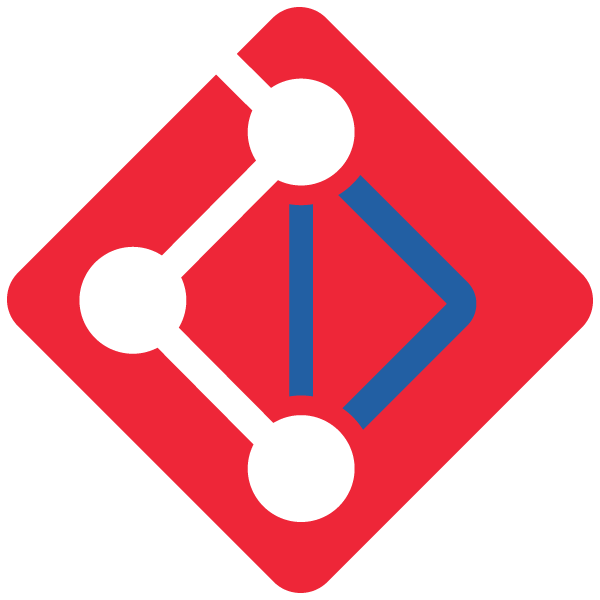

#  Code of Conduct

---

## ✋ Our Pledge

We, as members, contributors, and leaders of this community, pledge to make participation in our project a harassment-free experience for everyone—regardless of age, body size, disability, ethnicity, gender identity or expression, level of experience, nationality, race, religion, or sexual orientation.

We do **not** tolerate hate speech, bigotry, discrimination, or any form of intolerance.  
Individuals who promote or engage in such behaviors will be **permanently banned** from the project and its community.

**Period. Full Stop. No exceptions.**

We pledge to act and interact in ways that build an open, welcoming, diverse, inclusive, and healthy community.

---

## 🧭 Our Standards

Examples of behavior that contributes to a positive environment:
- Showing empathy and kindness to others  
- Being respectful of differing opinions and experiences  
- Giving and gracefully accepting constructive feedback  
- Taking responsibility and apologizing when mistakes are made  
- Using inclusive language  
- Prioritizing community well-being over individual gain

Examples of unacceptable behavior:
- Use of sexualized language or imagery; sexual attention or advances  
- Trolling, insulting or derogatory comments; personal or political attacks  
- Public or private harassment  
- Publishing others’ private information without permission  
- Promotion of extremist ideologies, hate speech, or discriminatory content  
- Disruptive behavior in community spaces

---

## 🌐 Scope

This Code of Conduct applies in all project spaces—both online and offline—including GitHub repositories, discussion forums, virtual meetings, chatrooms, and social media when representing the project.

---

## 🛡️ Enforcement Responsibilities

Project maintainers are responsible for upholding and enforcing this Code of Conduct fairly and consistently.

They may remove, edit, or reject comments, commits, issues, and contributions that violate this Code and will communicate reasons for moderation decisions when appropriate.

---

## 🚨 Enforcement Process

### 1. Correction  
**Impact:** Minor offense or unintentional behavior  
**Action:** A private reminder or request to modify behavior

### 2. Warning  
**Impact:** Repeated or moderately harmful behavior  
**Action:** Formal warning and required distancing from affected individuals and channels for a period

### 3. Temporary Ban  
**Impact:** Serious violation or sustained misconduct  
**Action:** Temporary ban from all public and private community spaces

### 4. Permanent Ban  
**Impact:** Repeated violations, targeted harassment, or hate-based conduct  
**Action:** Permanent expulsion from all project-related activities and spaces

---

## 📣 Reporting Violations

If you experience or witness unacceptable behavior, report it via:

📧 **[conduct@bluewatermvc.org](mailto:conduct@bluewatermvc.org)**  

Reports are confidential, will be reviewed promptly, and handled with care.  
All maintainers are obligated to respect the privacy of reporters.

---

## 📝 Attribution

This Code of Conduct is based on the [Contributor Covenant v2.1](https://www.contributor-covenant.org/version/2/1/code_of_conduct.html) and adapted with original language from the Bluewater project’s contributor policy.

---

## 🔗 Related Policies & References

- [CONTRIBUTING.md](./CONTRIBUTING.md)  
- [GOVERNANCE.md](./GOVERNANCE.md)  
- [SECURITY.md](./SECURITY.md)  
- Translation Status Policy *(coming soon)*
- Header and Metadata Policy *(coming soon)*
* [SYNC\_PROCESS.](./SYNC_PROCESS.md) 
- Notification and Team Assignment Policy *(coming soon)*  
- [SYNC_PROCESS.md](./SYNC_PROCESS.md)

---

_LastUpdate: 2025-07-12_<br>  
_Next Review: 2026-07-01_
```
