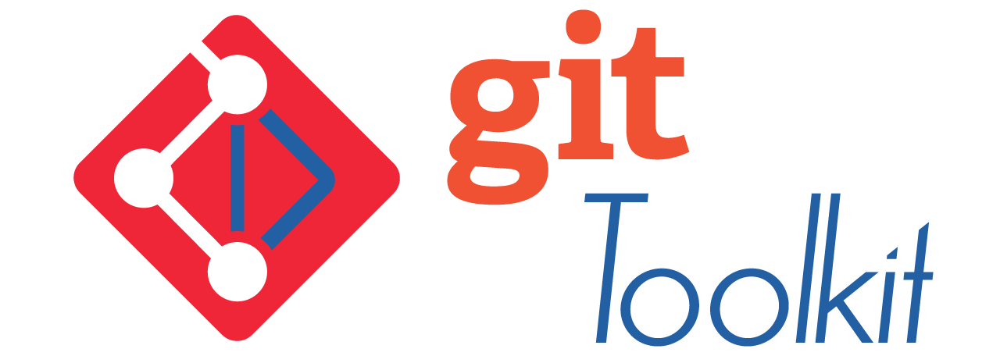

<!--
 file: CONTRIBUTING.md
 path: L:/var/www/Git-Toolkit/.github/CONTRIBUTING.md
 version: 1.0.0
 date: 2026-03-13
 author: Walter Torres
 copyright: Copyright 2026, Git-Toolkit.
 license: MIT
 maintainer: Git-Toolkit Team
 status: dev

 Guidelines for contributing to the Git Toolkit project.
-->

# 🤝 Contributing to Git Toolkit

Thank you for considering contributing to **Git Toolkit** — a per-project, scriptable Git automation tool designed for consistency, safety, and speed across teams and platforms.

We welcome all kinds of contributions: 🧠 ideas, 💬 feedback, 📚 docs, 🐛 bug reports, and 💻 code.

---

## 📑 Table of Contents

- [📜 Code of Conduct](#-code-of-conduct)
- [🧭 Where to Start](#-where-to-start)
- [📌 General Guidelines](#-general-guidelines)
- [🔨 Development Process](#-development-process)
- [📥 Pull Requests](#-pull-requests)
- [🐞 Issues & Feature Requests](#-issues--feature-requests)
- [⚙️ Script Style & Standards](#-script-style--standards)
- [📝 Documentation Standards](#-documentation-standards)
- [🔁 Sync, Integration & Tooling](#-sync-integration--tooling)
- [📄 Licensing](#-licensing)
- [🧑‍🤝‍🧑 Community](#-community)
- [🆘 Getting Help](#-getting-help)
- [🌍 Translations](#-translations)

---

## 📜 Code of Conduct

By participating in this project, you agree to uphold our [Code of Conduct](./CODE_OF_CONDUCT.md).  
We enforce it to ensure a respectful and inclusive community for all contributors.

---

## 🧭 Where to Start

We use GitHub issues to manage work and discussion. To get started:

1. Browse the [issue tracker](https://github.com/phpwalter/Git-Toolkit/issues)
2. Look for issues labeled **`good first issue`** or **`help wanted`**
3. Comment to express interest and ask for clarification if needed
4. Fork the repo and create your own feature branch

>Before contributing, please read the [Project Charter](../CHARTER.md) to understand the vision and scope of Git Toolkit
> 
---

## 📌 General Guidelines

- Use clear, descriptive commit messages
- Prefer small, focused changes over large, sprawling ones
- Add/update tests when introducing new functionality
- Respect our CI/CD and hook workflows
- Sync frequently with `main` or `dev` (as specified)

---

## 🔨 Development Process

We follow a PR-based model:

1. Fork → Branch → Work locally
2. Follow `.flake8`, formatting, and script standards
3. Run tests before pushing
4. Submit a PR to `main` or `dev` (depending on the issue)
5. A maintainer will review, provide feedback, and help merge

---

## 📥 Pull Requests

PRs must:

- Pass CI (GitHub Actions)
- Include relevant tests or docs
- Not break existing YAML config patterns
- Be atomic (1 purpose per PR)

Pro Tip: Reference issues like `Closes #42` in your PR description.

---

## 🐞 Issues & Feature Requests

We appreciate clear and detailed reports.

Please include:

- ✅ What happened
- ✅ Expected vs. actual behavior
- ✅ Steps to reproduce (or a failing config/command)
- ✅ Environment info (OS, Python version)

Feature requests should describe **why** the feature matters, not just what it does.

---

## ⚙️ Script Style & Standards

- Python 3.7+ with `black`, `flake8`, and `isort`
- YAML is checked using `yamllint`
- Hook logic must not break when run inside submodules
- Use `pathlib`, no hardcoded OS paths
- Use SPDX license headers where applicable

---

## 📝 Documentation Standards
We maintain a high documentation-to-code ratio. Please ensure:
- **Location:** General docs live in `docs/en/`. Tool-specific docs live in `docs/tools/`.
- **Formatting:** Use Markdown. Filenames must be `kebab-case.md` (e.g., `technical-specifications.md`).
- **Consistency:** If you change a core feature, you must update the `ARCHITECTURE.md` and `Functional Requirements.md` in `docs/en/`.
- **Assets:** Place new diagrams or icons in `docs/assets/`. Use `.svg` or `.png` where possible.

---

## 🔁 Sync, Integration & Tooling

- CI runs on all PRs: `ci.yml`, `release.yml`
- Releases use `semantic-release` with changelog automation
- Coverage tracked via Codecov
- Run `./scripts/check` locally to lint before pushing
- Toolkit must remain scriptable from submodule context

---

## 📄 Licensing

All contributions must comply with the **MIT License**.

> By submitting a contribution, you agree that it will be licensed under the [MIT License](../LICENSE).  
> Files must include the appropriate license header (see `LICENSE_HEADER.txt` if available).

---

## 🧑‍🤝‍🧑 Community

We are committed to building a welcoming, inclusive environment.

- 🧭 Follow the [Code of Conduct](./CODE_OF_CONDUCT.md)
- 🛡️ See our [SECURITY.md](./SECURITY.md) for vulnerability reporting
- 🧾 Project governance is defined in [GOVERNANCE.md](./GOVERNANCE.md)

---

## 🆘 Getting Help

- Open a [GitHub Discussion](https://github.com/phpwalter/Git-Toolkit/discussions)
- Tag maintainers in relevant issues or PRs
- Email: 📧 [contribute@bluewatermvc.org](mailto:contribute@bluewatermvc.org)  
  *(or suggest preferred team contact route)*

---

## 🌍 Translations
We use a structured translation system. To contribute a new language:
1. Create a new directory: `docs/{lang-code}/` (e.g., `docs/es/`).
2. Copy the contents of `docs/en/` to your new folder.
3. Translate the files, maintaining the same filenames.
4. Update `TRANSLATIONS.md` in the root to include your new language.

---

*Thank you for helping improve Git Toolkit!*

*Last updated: 2025-07-16*
*Next review: 2026-07-01*
