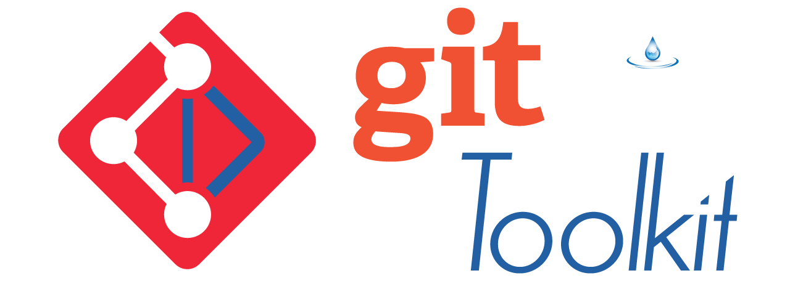

# 🧭 Git Toolkit – Project Charter

---

## 🎯 Mission Statement

**Git Toolkit** is a lightweight, per-project command-line utility that standardizes and automates Git workflows across development teams, repositories, and platforms.

We aim to reduce human error, simplify repetitive tasks, and create a consistent developer experience — from onboarding to release.

---

## 👥 Target Audience

- Solo developers maintaining personal or hobby projects
- Professional software teams managing monorepos or polyrepos
- DevOps engineers and release managers seeking CI/CD consistency
- Open source maintainers who want safe, reusable Git scripts
- Teams working across Windows, macOS, and Linux

---

## 🧱 Core Principles

- 🧩 **Composable** – Reusable logic and workflows via YAML
- 📦 **Per-project scoped** – No global dependencies or assumptions
- ⚡ **Zero-touch** – Smart defaults, minimal configuration required
- 🔒 **Safe by default** – Protects branches, validates steps
- 🌍 **Inclusive** – Docs localization and contributor accessibility
- 🔌 **Extensible** – Hooks and plugins allow custom behavior

---

## 📌 In-Scope Objectives

- Git workflow automation via GitPython and shell wrappers
- Local project automation through `.git-toolkit.yml`
- Multi-repo orchestration and submodule handling
- Customizable lifecycle hooks (`pre_push`, `post_clone`, etc.)
- Plugin framework for Python-based extensions
- Integration with Git Credential Manager and PAT keyring
- CLI script usable in both terminal and CI/CD pipelines

---

## 🚫 Out-of-Scope (for now)

- Full OAuth integration (planned Phase 2)
- GUI frontends or Git client replacements
- Non-Git SCM (e.g. Mercurial, SVN)
- Hosting-provider-specific features (e.g. GitHub-only automations)
- Publishing to PyPI (install via path or submodule only)

---

## 🛣️ Long-Term Vision

We envision Git Toolkit as:

- A **modular Git automation layer** embedded within any codebase
- A **self-documenting command runner** with multilingual support
- A lightweight **compliance and policy enforcer** for code movement
- An **OSS-first reference architecture** for Git-native tooling

---

## 🔗 Governance & Accountability

The project is governed by the community as outlined in:

- [GOVERNANCE.md](./.github/GOVERNANCE.md)
- [CODE_OF_CONDUCT.md](./.github/CODE_OF_CONDUCT.md)
- [CONTRIBUTING.md](./.github/CONTRIBUTING.md)

All major decisions will follow open discussion, consensus-building, and community votes when needed.

---

## 🗓 Review and Amendments

This charter is a living document. It will be reviewed yearly or when major changes occur.

_Last updated: 2025-07-16_  
_Next review: 2026-07-01_
