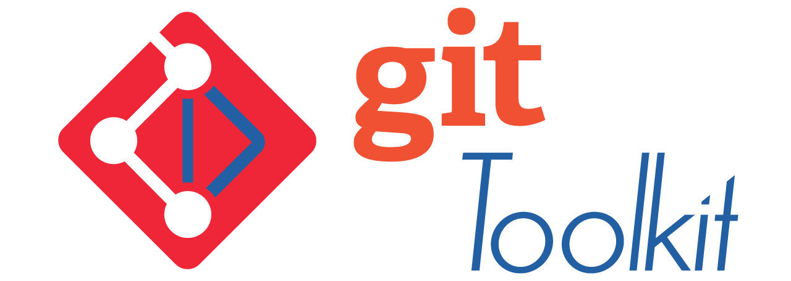

<!-- Badge Block -->




**Git Toolkit** is a lightweight, per-project CLI utility for automating and standardizing Git workflows across development teams and repositories.

Rather than being installed globally, Git Toolkit is added to each repository as a Git submodule. Each project defines its own Git commands, automation rules, and multi-repo workflows using a `.git-toolkit.yml` configuration file stored in version control.

Built with **Python** using **GitPython**, and configured via **YAML**, Git Toolkit simplifies repetitive Git tasks, reduces human error, and promotes consistent practices across your team.

---
## 📑 Table of Contents

- [🚀 Features](#-features)
  - [🧠 Workflow Automation](#-workflow-automation)
  - [⚙️ Configuration & Extensibility](#️-configuration--extensibility)
  - [🔐 Security & Authentication](#-security--authentication)
  - [🛠 Compatibility & Platform Support](#-compatibility--platform-support)
- [🚀 Quick Start](#-quick-start)
- [🧪 Basic Usage](#-basic-usage)
- [📁 Directory Structure](#-directory-structure)
  - [🧩 User Project Structure](#-user-project-structure)
  - [🛠 Git Toolkit Source Repository (Contributor View)](#-git-toolkit-source-repository-contributor-view)
- [⚙️ Configuration (.git-toolkit.yml)](#️-configuration-git-toolkityml)
- [⚡ Automatic Behavior](#-automatic-behavior)
- [🔌 Extensibility](#-extensibility)
- [✅ Use Cases](#-use-cases)
- [🗂 Quick Reference](#-quick-reference)
- [📚 Documentation](#-documentation)
- [🛠 Requirements](#-requirements)
- [📄 License](#-license)
- [👤 Author](#-author)


## 🚀 Features

### 🧠 Workflow Automation
- 🔁 **Reusable Git commands** – Define high-level workflows using familiar Git operations: `clone`, `status`, `checkout`, `commit`, `push`, `submodule update`, etc.
- 🧩 **Hooks system** – Lifecycle hooks like `pre_clone`, `post_push`, `pre_commit`, and more for customizing project behavior.
- 🔄 **Multi-repo support** – Orchestrate actions across multiple repos (monorepos, microservices, or submodules).

### ⚙️ Configuration & Extensibility
- 🔧 **Per-project config** – `.git-toolkit.yml` stored in each repo.
- 🌍 **Global config support** – Optional global config in `~/.git-toolkit/config.yml`.
- 🔌 **Plugin support** – Extend functionality via Python entry points and drop-in scripts.
- 🗣️ **Localization support** – Document workflows in `docs/<lang>/` for team-wide clarity.

### 🔐 Security & Authentication
- ✅ **Safe by default** – Prevent force pushes or branch deletion on protected branches.
- 🔐 **Authentication options**:
    - Git Credential Manager (default)
    - Personal Access Token (PAT) via OS keyring
    - *(Coming soon)* OAuth for GitHub, GitLab, and Bitbucket

### 🛠 Compatibility & Platform Support
- 🖥️ **Cross-platform** – Works on Linux, macOS, and Windows
- 🧰 **CI/CD ready** – Enforce Git workflows in pipelines or local automation
- ⚡ **Zero-touch startup** – Auto-discovers repos and runs common commands without manual setup


## 🚀 Quick Start

From your project directory:

```bash
git submodule add https://github.com/phpwalter/git-toolkit.git .git-toolkit
cp .git-toolkit/.git-toolkit.example.yml .git-toolkit.yml
````

Then, install Python dependencies (if needed):

```bash
pip install -r .git-toolkit/requirements.txt
```

---

## 🧪 Basic Usage

Run toolkit commands from your project root:

```bash
.git-toolkit/git-toolkit <command>
```

Example:

```bash
.git-toolkit/git-toolkit release
```

To make this easier, you can symlink or wrap the command:

```bash
ln -s .git-toolkit/git-toolkit git-toolkit
./git-toolkit status
```

---

## 📁 Directory Structure

Git Toolkit has **two views** depending on the user:

### 🧩 User Project Structure

This is what your project looks like when Git Toolkit is used as a submodule:

```
your-project/
├── .git/
├── .git-toolkit/            # Git Toolkit submodule
├── .git-toolkit.yml         # Project-specific Git Toolkit config
├── src/
└── ...
```

### 🛠 Git Toolkit Source Repository (Contributor View)

If you're working on Git Toolkit itself (e.g. contributing or debugging):

```
.
├── README.md
├── PROPOSAL.md
├── config_default.yaml
├── git_toolkit/
│   ├── cli.py, config.py, hooks.py, ...
│   └── tests/
│       └── test_*.py
├── docs/
│   ├── en/, es/, fr/         # Internationalized documentation
│   └── ...
└── .github/
    ├── CONTRIBUTING.md
    ├── CODE_OF_CONDUCT.md
    ├── GOVERNANCE.md
    ├── SECURITY.md
    ├── SYNC_PROCESS.md
    ├── DOCS_SYNC.md
    ├── WORKFLOW.md
    ├── ISSUE_TEMPLATE/
    └── workflows/
```

---


## ⚙️ Configuration (`.git-toolkit.yml`)

Each project defines its automation rules and repo structure using YAML.

### Example

```yaml
repositories:
  - name: main
    path: .
  - name: ui
    path: ./packages/ui
    default_branch: main

commands:
  status:
    script: |
      git -C {{repo.path}} status

  release:
    steps:
      - tag: v{{ version }}
      - push-tags: true

safety:
  prevent_force_push: true
  protect_branches:
    - main
    - release/*
```

---

## ⚡ Automatic Behavior

Some behaviors are available **out of the box**, without requiring config:

* If `.git-toolkit.yml` is missing, the toolkit will warn but attempt to run default logic.
* Repository discovery may be automatic (e.g. by scanning subdirectories).
* Common commands like `status`, `push`, and `pull` may be pre-defined unless overridden.

This allows you to start using Git Toolkit with **zero configuration**, then customize as needed.

---

## 🔌 Extensibility

You can extend Git Toolkit through:

* **Hooks**: Run pre/post scripts on events (e.g. pre-push, post-merge)
* **Plugins**: Drop-in Python modules for advanced logic
* **Script steps**: Run Bash, Python, or other scripts from YAML-defined workflows

---

## ✅ Use Cases

* Automate version tagging and changelog generation
* Standardize branch naming and protection
* Manage multiple Git repositories with a single command
* Enforce team-specific Git policies or commit formatting
* Seamlessly integrate Git processes into your CI/CD pipeline

---

## 🗂 Quick Reference

| Context             | Folder Location    | Description                             |
|---------------------|--------------------|-----------------------------------------|
| **User Project**    | `.git-toolkit/`    | Toolkit submodule added to your repo    |
|                     | `.git-toolkit.yml` | Project-level config file               |
| **Toolkit Project** | `git_toolkit/`     | CLI code, hooks, plugin system          |
|                     | `docs/<lang>/`     | Multilingual documentation              |
|                     | `.github/`         | Community, CI/CD, governance, templates |

---

## 📚 Documentation

More documentation coming soon. For now:

* [Sample configuration](docs/en/sample-config.yml)
* [Extending Git Toolkit](docs/en/extending.md)
* [Built-in command reference](docs/en/commands.md)

---

## 🛠 Requirements

* Python 3.7+
* [GitPython](https://gitpython.readthedocs.io/en/stable/)

---

## 📄 License

MIT License. See [`LICENSE`](LICENSE) for details.

---

## 👤 Author

Created by [@phpwalter](https://github.com/phpwalter)

> If Git is your team's power tool, **Git Toolkit** is the workshop that makes using it safe, fast, and consistent.

---

_Last updated: 2025-07-16_<br>
_Next review: 2026-07-01_
