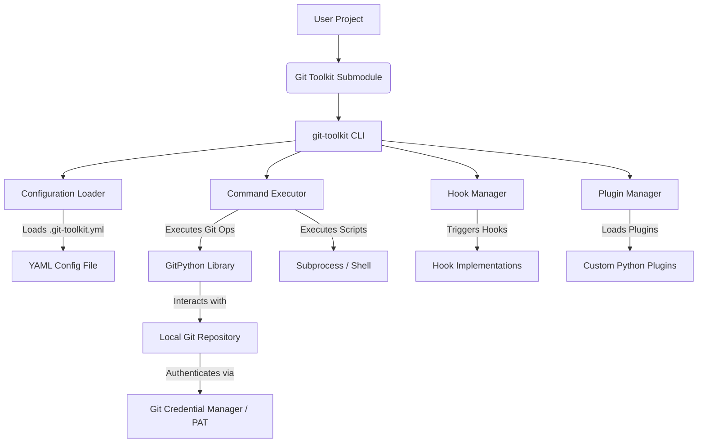

<!--
 file: Technical_specifications.md
 path: L:/var/www/Git-Toolkit/docs/en/Technical_specifications.md
 version: 1.0.0
 date: 2026-03-13
 author: Walter Torres
 copyright: Copyright 2026, Git-Toolkit.
 license: MIT
 maintainer: Git-Toolkit Team
 status: dev

 Details the technical design, architecture, and implementation specifics of the Git Toolkit project.
-->


#  Technical Specifications Document – Git Toolkit

## 1. Introduction

### 1.1. Purpose
This Technical Specifications Document (TSD) details the technical design, architecture, and implementation specifics of the **Git Toolkit** project. It serves as a guide for developers, maintainers, and anyone seeking a deeper understanding of the system's internal workings, component interactions, and underlying technologies.

### 1.2. Scope
This document covers the technical design of the Git Toolkit's core components, including its CLI, configuration parsing, Git operation handling, hook and plugin mechanisms, and authentication integration. It describes the system's architecture, technology stack, and key data flows.

**In-Scope:**
*   System Architecture and Component Design.
*   Technology Stack and Core Libraries.
*   Configuration Data Model and Parsing.
*   Command Execution Flow.
*   Hook and Plugin System Design.
*   Authentication Integration Mechanisms.
*   Error Handling and Logging Strategy.
*   Testing Strategy.

**Out-of-Scope:**
*   Detailed code-level implementation (e.g., specific class methods, line-by-line logic, which are covered in code comments).
*   User-facing documentation (covered in `README.md`, `Developer Guide.md`, `FAQ.md`).
*   Project management details (covered in `PROPOSAL.md`, `MILESTONES.md`, `ROADMAP.md`).

### 1.3. Definitions, Acronyms, and Abbreviations
*   **CLI**: Command Line Interface
*   **TSD**: Technical Specifications Document
*   **GCM**: Git Credential Manager
*   **PAT**: Personal Access Token
*   **YAML**: YAML Ain't Markup Language (configuration file format)
*   **GitPython**: Python library for interacting with Git repositories.
*   **PyYAML**: Python library for parsing YAML.
*   **argparse**: Python standard library for parsing command-line arguments.

### 1.4. References
*   [README.md](../../README.md)
*   [PROPOSAL.md](../../PROPOSAL.md)
*   [Functional Requirements](functional_requirements.md)
*   [Developer Guide](developer_guide.md)
*   [SECURITY.md](../../.github/SECURITY.md)
*   [CONTRIBUTING.md](../../.github/CONTRIBUTING.md)

---

## 2. System Architecture

### 2.1. High-Level Architecture
The Git Toolkit is designed as a modular, Python-based CLI application integrated into projects as a Git submodule. Its architecture emphasizes per-project customization, extensibility, and seamless interaction with Git repositories.



### 2.2. Component Breakdown

#### 2.2.1. CLI Interface (`git_toolkit/cli.py`)
*   **Responsibility**: Parses command-line arguments, dispatches commands, and manages the overall application flow.
*   **Technology**: `argparse` (or similar CLI framework).
*   **Interaction**: Interacts with `Configuration Loader`, `Command Executor`, `Hook Manager`, and `Plugin Manager`.

#### 2.2.2. Configuration Loader (`git_toolkit/config.py`)
*   **Responsibility**: Reads, parses, and validates the `.git-toolkit.yml` file. Provides a structured representation of the project's configuration.
*   **Technology**: `PyYAML` for parsing, Pydantic (or similar) for schema validation and object mapping.
*   **Data Model**: Represents repositories, commands, hooks, and safety rules as Python objects.
*   **Interaction**: Provides configuration data to `Command Executor`, `Hook Manager`, and `Plugin Manager`.

#### 2.2.3. Git Operations Handler (`git_toolkit/git_actions.py`)
*   **Responsibility**: Abstracts direct interaction with Git. Executes Git commands using the `GitPython` library.
*   **Technology**: `GitPython`.
*   **Interaction**: Called by `Command Executor` to perform Git actions. Handles repository context.

#### 2.2.4. Command Executor (`git_toolkit/commands.py`)
*   **Responsibility**: Interprets and executes defined commands (both built-in and custom). Orchestrates calls to `Git Operations Handler` and `Subprocess / Shell` for script execution.
*   **Interaction**: Receives command definitions from `Configuration Loader`. Triggers `Hook Manager`.

#### 2.2.5. Hook Manager (`git_toolkit/hooks.py`)
*   **Responsibility**: Manages the registration and execution of pre/post hooks. Ensures hooks are triggered at appropriate points in the workflow.
*   **Interaction**: Receives hook definitions from `Configuration Loader` and `Plugin Manager`. Invokes registered hook functions/scripts.

#### 2.2.6. Plugin Manager (`git_toolkit/plugins.py`)
*   **Responsibility**: Discovers and loads Python plugins. Registers plugin-defined commands and hooks with the respective managers.
*   **Mechanism**: Uses Python entry points or a defined local plugin directory.
*   **Interaction**: Extends `Command Executor` and `Hook Manager` capabilities.

#### 2.2.7. Authentication Manager (`git_toolkit/auth.py`)
*   **Responsibility**: Handles Git authentication, primarily by ensuring `GitPython` operations leverage GCM or configured PATs.
*   **Interaction**: Configures `GitPython`'s environment or credentials.

#### 2.2.8. Utility Modules (`git_toolkit/utils.py`, etc.)
*   **Responsibility**: Provides common helper functions, logging, error handling, and cross-platform utilities.

---

## 3. Technology Stack

*   **Primary Language**: Python 3.7+
*   **Git Interaction**: `GitPython`
*   **Configuration Parsing**: `PyYAML`
*   **CLI Framework**: `argparse` (or potentially `Typer` for more advanced CLI features)
*   **Testing**: `pytest`
*   **Code Quality**: `black` (formatter), `flake8` (linter)

---

## 4. Data Model: `.git-toolkit.yml`

The `.git-toolkit.yml` file defines the project-specific configuration. Internally, this YAML structure is parsed into a set of Python objects (e.g., `Config`, `Repository`, `Command`, `Hook`) for easy access and manipulation within the application.

### Example Structure and Internal Representation

```yaml
# .git-toolkit.yml
repositories:
  - name: main
    path: .
    default_branch: main
  - name: feature_repo
    path: ./features/my-feature

commands:
  my-custom-status:
    description: "Shows status for main and feature_repo"
    script: |
      echo "Main Repo Status:"
      git -C {{repo.main.path}} status
      echo "Feature Repo Status:"
      git -C {{repo.feature_repo.path}} status

hooks:
  pre_push:
    script: "python validate_commit_message.py"

safety:
  prevent_force_push: true
  protect_branches:
    - main
    - release/*
```

**Internal Representation (Conceptual):**
```python
class Repository:
    name: str
    path: str
    default_branch: Optional[str]

class Command:
    name: str
    description: Optional[str]
    script: Optional[str]
    steps: Optional[List[Dict]] # For more structured commands

class Hook:
    event: str
    script: Optional[str]
    # ... other hook properties

class Safety:
    prevent_force_push: bool
    protect_branches: List[str]

class Config:
    repositories: List[Repository]
    commands: List[Command]
    hooks: List[Hook]
    safety: Safety
    # ... other top-level config
```

---

## 5. Core Workflows

### 5.1. Command Execution Flow
1.  **CLI Invocation**: User runs `git-toolkit <command> [args]`.
2.  **Argument Parsing**: `cli.py` parses arguments, identifies the command.
3.  **Config Loading**: `config.py` loads and validates `.git-toolkit.yml`.
4.  **Command Resolution**: `commands.py` looks up the command definition (built-in or custom).
5.  **Pre-Command Hooks**: `hooks.py` executes any `pre_<command>` hooks. If a hook fails, execution stops.
6.  **Command Execution**: `commands.py` executes the command's logic:
    *   For Git operations: Calls `git_actions.py`.
    *   For scripts: Executes via `subprocess` or `shell`.
7.  **Post-Command Hooks**: `hooks.py` executes any `post_<command>` hooks.
8.  **Result/Error Reporting**: Output is displayed to the user.

### 5.2. Hook Execution Flow
1.  **Trigger Point**: A Git operation or command execution reaches a defined hook point.
2.  **Hook Lookup**: `hooks.py` identifies all registered hooks for that event (from config or plugins).
3.  **Context Provision**: Relevant context (e.g., current repository, command arguments) is prepared and passed to the hook.
4.  **Hook Execution**: Each hook (script or Python function) is executed sequentially.
5.  **Failure Handling**: If a `pre-` hook returns a non-zero exit code or raises an exception, the main operation is aborted.

---

## 6. Extensibility Design

### 6.1. Hooks
Hooks are implemented as Python functions or shell scripts.
*   **Configuration-based hooks**: Defined directly in `.git-toolkit.yml` under the `hooks` section. These are typically simple scripts.
*   **Plugin-based hooks**: Python functions within a plugin module decorated with a hook registration mechanism. These allow for more complex logic and access to internal toolkit state.

### 6.2. Plugins
Plugins are Python modules that reside in a designated directory (e.g., `git_toolkit/plugins/` or a user-defined path).
*   **Discovery**: The `Plugin Manager` scans these directories for valid plugin modules.
*   **Registration**: Plugins can expose functions or classes that the `Command Executor` or `Hook Manager` can register. For example, a plugin might define a new CLI command or a complex `pre_push` validation.
*   **API**: A well-defined API will be exposed for plugins to interact with the core toolkit functionalities (e.g., accessing configuration, performing Git operations).

---

## 7. Security Design Considerations

*   **Input Validation**: All user-provided input (CLI arguments, config values) will be rigorously validated to prevent injection attacks or unexpected behavior.
*   **Restricted Shell Execution**: When executing user-defined scripts, the system will aim to use `subprocess.run` with `shell=False` where possible, or sanitize inputs carefully if `shell=True` is unavoidable.
*   **Credential Handling**: Authentication tokens (PATs) will be handled securely, preferring OS keyring integration over plain-text storage.
*   **Protected Operations**: Core Git operations like force pushes to protected branches will be explicitly blocked based on `safety` configurations.
*   **Dependency Management**: Regular security scanning of Python dependencies will be integrated into the CI/CD pipeline.

---

## 8. Error Handling and Logging

*   **Centralized Error Handling**: A consistent error handling mechanism will be implemented to catch exceptions and provide informative messages.
*   **User-Friendly Errors**: Error messages will be designed to be actionable, guiding the user on how to resolve the issue.
*   **Logging**: The system will use Python's standard `logging` module. Configurable log levels will allow users to get more detailed output for debugging.
*   **Traceability**: Error messages will include context (e.g., which command, which hook) to aid in debugging.

---

## 9. Testing Strategy

*   **Unit Tests**: Focused on individual functions and methods within modules (e.g., config parsing, Git operation wrappers).
*   **Integration Tests**: Verify the interaction between different components (e.g., CLI parsing -> command execution -> Git operation).
*   **End-to-End Tests**: Simulate real-world usage scenarios, including loading a full `.git-toolkit.yml` and executing commands.
*   **CI Integration**: All tests will be run automatically as part of the CI/CD pipeline.
*   **Coverage**: Aim for a minimum of 80% test coverage for core modules.

---

## 10. Deployment and Integration

*   **Submodule Deployment**: The toolkit is designed to be deployed as a Git submodule, ensuring its version is tied to the consuming project.
*   **CI/CD Integration**: The CLI is headless and designed to be easily invoked within CI/CD environments. Authentication via PATs is crucial here.
*   **Python Environment**: Relies on a standard Python environment with `requirements.txt` for dependency management.

---

## 11. Future Considerations

*   **Advanced Plugin API**: Further refine the plugin API to allow deeper integration and more complex extensions.
*   **Performance Optimizations**: Investigate areas for performance improvement, especially for large multi-repository operations.
*   **Enhanced Error Reporting**: More structured error outputs (e.g., JSON) for programmatic consumption.

---

_Last updated: 2025-07-17_<br>
_Next review: 2026-07-01_
